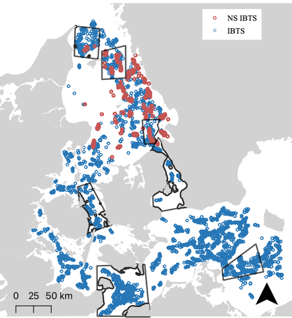

```{r setup, include=FALSE}
knitr::opts_chunk$set(echo = TRUE)
```

## Data
```{r figs, echo=FALSE, out.width= "30%", out.extra='style="float:right; padding:10px"'}

```
Data er hentet fra ICES’ Database of Trawl Surveys ([DATRAS](https://www.ices.dk/data/data-portals/Pages/DATRAS.aspx)). For at dække hele Danmark, er to surveys brugt: 

* North Sea International Bottom Trawl Survey (NS-IBTS)
* Baltic International Trawl Survey (BITS). 

7 polygoner/områder er lavet i QGIS og data er klippet til hvert område. Dvs. der nu er 7 datasæt: et over hvert område. Hvert område er valgt ud fra følgende: 

*	Der skal være nok hauls, der går langt nok tilbage i tiden 
*	Mange datapunkter (hauls)
*	Repræsentere, så vidt muligt, forskellige fysiske parametre

En shape-fil af havbundssediment ([DHI, EuSeaMap, BALANCE](https://metadata.helcom.fi/geonetwork/srv/eng/catalog.search#/metadata/ab71bbf8-eacc-4a93-9504-46210da8fe6d)) tilføjes og klippes til, så det passer til områderne, for på den måde senere at kunne tilføje en kolonne i attributtabellen om sedimenttype. Billedet til højre viser placeringen af områder samt hauls fra hhv. NS-IBTS og BITS. 


## Data rensning og præperering

**(mange af de valg der er taget, i forhold til rensning af data er taget på baggrund af en masse deskriptiv statistik). Data rensning er dokumenteret i et R-script.**

Derudover inddeles hver art i tre størrelser ud fra både biologiske kriterier samt min/maks længder for fangst (se skema i app)
For hvert område/art/størrelse er følgende datapræparering/rensning foretaget: 

*	Kun kvartal 1 og 4
*	Kun > år 2000
*	Der laves en ny kolonne med et ”unikt” haul ID, da der ellers tælles fra 1 ved hvert nyt år. 
*	Alle længdeklasser skal repræsenteres, så der tilføjes ”0” i de klasser, der ikke er fanget i haulet.
*	En ny kolonne tilføjes med den summerede ”CPUE_number_per_hour” for hvert unikt haul af den specifikke kombination af art, størrelsesklasse og område. 
*	Et nyt datasæt (.csv) gemmes for hver art og en kolonne (source) der fortæller hvilket område og størrelse der er tale om. F.eks. øresund_codJ (for juvenile torsk i øresund). I alt **6 csv-filer**.

Tabellen nedenfor viser antallet af hauls i hvert område efter datarensning.

|Område                          | Antal hauls |
| :----------------------------- | :---------: |
|Nordlige Kattegat               | 154         |
|Kattegat, vest for Læsø         | 225         |
|Kattegat, nord for Øresund      | 77          |              
|Øresund                         | 143         |
|Storebælt                       | 231         |    
|Mecklenburg Bugten              | 372         |            
|Østersøen, sydvest for Bornholm | 260         | 


## Generalised Additive Mixed Models (GAMM)

De nye csv-filer bruges til at lave GAMM-modellerne.
Nedstående er et eksempel på en model i R for juvenile rødspætter i Øresund:

```{r gam, eval=FALSE}
mod.plaiceJ <- gam(cpue ~
                     period +
                     s(depth, k = 15) + 
                     s(Gear, bs= "re") + 
                     Quarter + 
                     SedimentDK, 
                   data= subset(dat_plaice, loc== "øresund_plaiceJ"), family = tw)

mod.plaiceJ <- get.mini.model(mod. plaiceJ, check.terms = c("period", "depth", "Quarter", "SedimetnDK"))
```

Hvor 

* `cpue` er responsvariablen og er den summerede CPUE_number_per_hour for alle længder af arten i størrelsesgruppen i et haul. 
*	`period` er en af følgende perioder: 2000-2005, 2006-2012, 2013-2018, 2019-2024 (OBS der er kun data inkluderet til og med 2022)
*	`s(depth)` er dybden der er blevet trawlet på
*	`s(Gear)` er typen af gear der er brugt (læs mere på ICES hjemmeside)
*	`Quarter` er kvartalet, dvs enten kvartal 1 eller 4
*	`SedimentDK` er sedimenttypen. Der er fem forskellige typer. Sedimenttypen er identificeret på baggrund af ovennævnte sedimentkort samt longitude og latitude for de enkelte hauls. 

`get.mini.model` henviser til scriptet **funcs.R**, som finder den bedste, mindst komplekse model. Med modellerne udregnes nu en *”predicted CPUE"* og en *”predicted standard deviation”*. De gemmes som **newdat.rds**, så model-resultaterne kan bruges i shiny appen. I alt er lavet 126 modeller. Nogle modeller har ikke kunne konvergere og kan ses i tabellen nedenunder. Alle scripts kan findes på [github](https://github.com/lbering/Shiny-app).

#### Modeller med warnings

+--------------------------------+-----------------------+
|**Område**                      | **Art og størrelse**  |
+--------------------------------+-----------------------+
|Nordlige Kattegat               | - Voksne brisling     |
+--------------------------------+-----------------------+
|Kattegat, vest for Læsø         | - Juvenile skrubber   |
+--------------------------------+-----------------------+
|Kattegat, nord for Øresund      | - Voksne hvilling     |      
|                                | - Unge skrubber       |
|                                | - Juvenile skrubber   |
+--------------------------------+-----------------------+
|Øresund                         | - Juvenile skrubber   |
|                                | - Juvenile rødspætter |
+--------------------------------+-----------------------+
|Storebælt                       | - Voksne torsk        |    
|                                | - Voksne brisling     |
|                                | - Voksne hvilling     |
|                                | - Juvenile skrubber   |
+--------------------------------+-----------------------+
|Mecklenburg Bugten              | - Juvenile rødspætter |  
|                                | - Juvenile brisling   |
|                                | - Juvenile skrubber   |
|                                | - Voksne  brisling    |
|                                | - Voksne hvilling     |
+--------------------------------+-----------------------+
|Østersøen, sydvest for Bornholm | - Voksne torsk        | 
|                                | - Voksne brisling     |
|                                | - Voksne hvilling     |
+--------------------------------+-----------------------+